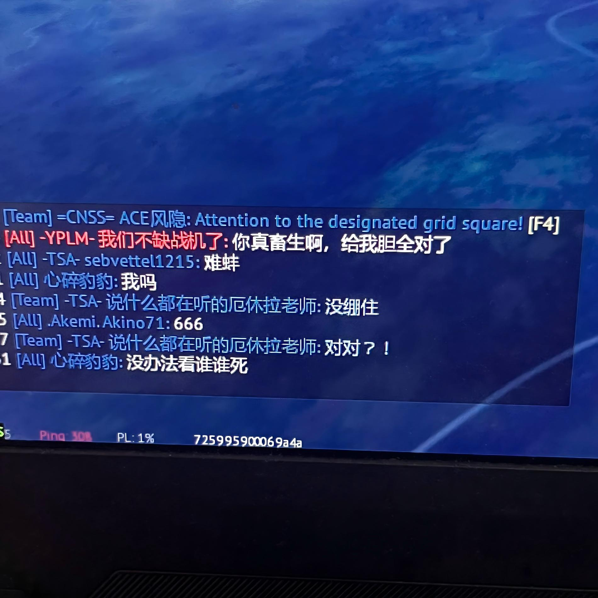

# 机械动力：先进火控：火控之眼

**Create: Fire Control - Fire Control Eye** · 版本 `1.0.0` · Minecraft 1.21.1 · NeoForge

为机械动力火炮·先进火控（`create-fire-control-0.5.9`）打造的弹药识别与火控增强扩展。它让先进火控的雷达「看见」更多武器模组的弹药，并补齐光电锁定、TWS 多目标跟踪、目标标注与提前量指示等空战/防空功能。

## 简介

火控之眼把以下模组的弹药统一接入先进火控的雷达体系：

- **vestalihy**：PTUR、TOW、PTUR-JET、Malytka、Tubus 等
- **CBC Military Supplement**：航空炸弹、鱼雷、火箭弹、深水炸弹、导弹
- **TAOV Weapons**：地狱火、Tau（Shaolib 弹体）
- **面包学现代战争**：导弹、火箭弹、JDAM 等

显示连接器雷达和自动反导能识别并拦截这些弹药；火控计算机连接雷达后，可以像扫描 Sable 结构一样扫出它们，并提供锁定框、类型标注、导弹/火炮引导，与 Sable 结构目标用法一致。

## 功能

- **弹药识别**：上述弹药全部进入显示连接器雷达和火控计算机雷达的扫描范围，自动反导可对其做出反应。
- **目标类型标注**：锁定框下方显示目标类型（`sable结构` / `弹药` / `生物`），类型由服务端下发，远距离弹药不会误标；地面雷达锁定后同时显示目标相对速度。
- **TWS 多目标跟踪**：机载与地面雷达可同时跟踪多个目标，锁定目标额外套一圈方框，其余目标框保持不丢。
- **光电锁定弹药**：光电锁定可锁住飞行中的弹药；光电与雷达双锁时只显示一份文字，互不覆盖。
- **提前量指示**：锁定框中心画出一条指向预测命中点的指示线，末端为小圆环，长度随目标速度与距离变化，机炮对准圆环开火即可命中。
- **空空导弹近炸**：空空导弹锁定实体弹药 / Shaolib 弹体时，近炸引信按弹药实际位置正常触发。
- **地狱火引导器**：适配先进火控头瞄系统，用法与面包学激光瞄准器一致。
- **显示连接器手动指示**：连接双机炮座 / 防空导弹发射器后，无需开启自动攻击，即可在显示连接器上手动指示目标带动双机瞄准。

## 安装要求（Minecraft 1.21.1 · NeoForge）

按以下顺序放入 `mods` 文件夹（本 mod 最后放）：

1. `create-fire-control-0.5.9.jar`（机械动力火炮：先进火控）
2. `sable-neoforge-1.21.1-2.0.5.jar`（结构子系统）
3. `create-1.21.1-6.0.10.jar`（机械动力）
4. `createbigcannons`（可选，大炮相关）
5. `taov_weapons-0.1.1.jar` + `shaolib-0.1.0.jar` + `shaolib_munitions-0.1.0.jar`（TAOV 武器）
6. `vestalihy-2.5.3.jar`（维斯太利弹药）
7. `[机械动力火炮：武器拓展] CBC-Military-Supplement-1.21.1-2.1.4.jar`（CBCMS）
8. `mianbaos_modernwarfare`（面包学现代战争）
9. 本 mod：`firecontrolcompat-1.0.0.jar`

## 使用方法

1. 把 `firecontrolcompat-1.0.0.jar` 放入 `mods` 文件夹，启动游戏。
2. 搭建显示连接器 + 雷达，打开「自动反导」和「导弹扫描」选项。
3. 从敌对方向发射/投掷上述弹药，雷达屏幕上会显示为导弹目标并被自动拦截。
4. 火控计算机连接雷达后，雷达页面会出现这些弹药的联系人；点击/锁定后即可使用防空导弹或火炮引导。
5. 锁定移动目标时观察锁定框下方的类型/速度文字与提前量指示线，对准圆环开火。

## 构建

`build.ps1` 会从本机 `.minecraft` 目录自动收集 Minecraft / NeoForge / 各模组的 jar 作为编译类路径，然后编译并打包 `firecontrolcompat-1.0.0.jar`。构建需要 Windows 与 Java 21 运行环境。

## 许可证

MIT License
